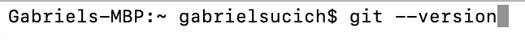
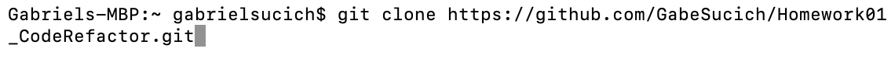

# Homework 01: Code Refactor

An HTML file and a CSS file were provided, which together yielded a website. Although the website rendered successfully, the HTML code was missing semantic keys, not properly formatted, and not thematically or aesthetically organized. Additionally, the CSS file was unorganized, had no comment tags explaining the styling, and was full of styling redundancies to be reduced. The goal of this project was to refactor the code so that it met a set of acceptance criteria relating to website accessibility standards. In the spirit of "leaving code cleaner than you found it", I was to revise the code so that, leaving the website unchanged (with the exception of fixing a bug), the issues outlined above were resolved. After finishing, the HTML and CSS files were clearer, more concise, and more well organized for others to read.

## Getting Started

These instructions will get you a copy of the project up and running on your local machine for development and testing purposes. See deployment for notes on how to deploy the project on a live system.

### Prerequisites

1. Install git by typing "git --version" in your terminal. If you are not sure if you have git or not, typing this will automatically prompt installation if you do not.

### Installing

To get access to this project for development and testing, go through the following steps:

1. Clone the project repository by navigating to a proper directory in terminal and typing `git clone https://github.com/GabeSucich/Homework01_CodeRefactor.git`:

2. Edit the HTML and CSS files, push to github, and see the live deployed website at the URL below.

## Built With

* [HTML](https://developer.mozilla.org/en-US/docs/Web/HTML)
* [CSS](https://developer.mozilla.org/en-US/docs/Web/CSS)
* [Javascript](https://developer.mozilla.org/en-US/docs/Web/JavaScript)

## Deployed Link

* [See Live Site](https://gabesucich.github.io/Homework01_CodeRefactor/)

## Authors

* Gabriel Sucich

- [Portfolio coming soon!](#)
- [Link to Github](https://github.com/GabeSucich)
- [Link to LinkedIn](www.linkedin.com/in/gabriel-sucich-6a28a71a8)

See also the list of [contributors](https://github.com/your/project/contributors) who participated in this project.

## License

This project is licensed under the MIT License 

## Acknowledgments

* Thanks to Trilogy Education Services, a 2U, Inc for providing the starter code for this project.
* Big shout out to Manuel for the detailed walkthroughs of using mark down.
